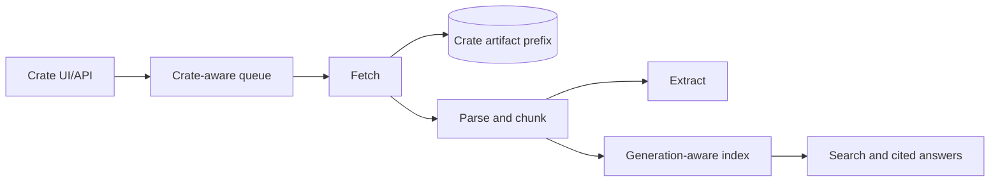

# ContextCrate

ContextCrate is a self-hosted crawling, extraction, retrieval, and cited-answer platform. Its top-level entity is a **crate**: an independently configured and authorized context workspace containing sources, crawl jobs, documents, extraction rules, provider settings, artifacts, and its own vector-index namespace.

## Capabilities

- Multiple crates with Owner, Editor, and Viewer memberships.
- Installation administration separated from crate content access, with audited 30-minute elevation.
- HTTP and Playwright crawling with SSRF controls, robots policy, authentication, retries, leases, and dead letters.
- Filesystem or S3 artifacts namespaced by crate.
- Normalized documents, deterministic chunks, extraction rules, and rebuildable results.
- Local ONNX or OpenAI-compatible embeddings configured per crate.
- Lucene or OpenSearch lexical, semantic, and RRF-hybrid retrieval.
- Versioned crate index generations with background rebuild and atomic activation.
- OpenAI-compatible cited answer streaming with crate-specific RAG policy.
- Personal API keys and crate-specific Viewer/Editor service keys.
- Archive, restore, retryable purge, and checksummed crate export/import.
- Standalone H2/Lucene mode and distributed PostgreSQL/RabbitMQ/S3/OpenSearch roles.

## Quick start

Requires JDK 25.

```bash
./mvnw verify
./mvnw spring-boot:run
```

Open <http://localhost:8080> and sign in with `admin@contextcrate.local` / `admin`. Set `CONTEXTCRATE_ADMIN_PASSWORD` before exposing the service.

```bash
docker run --rm -p 8080:8080 -v contextcrate-data:/app/data \
  -e CONTEXTCRATE_ADMIN_PASSWORD=change-me \
  ghcr.io/wenisch-tech/contextcrate:latest
```

The first authenticated user owns the automatically migrated Legacy crate. New users see crate onboarding according to the global creation policy.

## Architecture



Every content row, queue message, artifact key, and search operation carries crate identity. Lucene uses `data/index/crates/{crateId}/{generation}`; OpenSearch uses `{prefix}-crate-{crateId}-{generation}`.

## API

Swagger UI is available at `/api`.

```text
GET/POST /api/v1/crates
GET/POST /api/v1/crates/{crateId}/jobs
GET      /api/v1/crates/{crateId}/runs
GET      /api/v1/crates/{crateId}/documents
GET      /api/v1/crates/{crateId}/search
POST     /api/v1/crates/{crateId}/answers
GET/PUT  /api/v1/crates/{crateId}/settings/{rag|providers}
POST     /api/v1/crates/{crateId}/index/rebuild
POST     /api/v1/crates/{crateId}/exports
POST     /api/v1/crate-imports
```

The former unscoped content API was intentionally removed.

## Documentation

- [Crates and lifecycle](docs/crates.md)
- [Authorization](docs/authorization.md)
- [Architecture](docs/architecture.md)
- [Configuration](docs/configuration.md)
- [REST API](docs/api.md)
- [Operations](docs/operations.md)
- [Export and import](docs/backup-migration.md)
- [Upgrade from Harvex](docs/upgrade-from-harvex.md)
- [Tutorials](docs/tutorials.md)

ContextCrate is licensed under AGPL-3.0.
