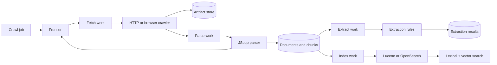

# Harvex

Harvex is a self-hosted crawling, extraction, and retrieval platform. It fetches raw pages, stores immutable artifacts, normalizes text and metadata with JSoup, creates deterministic chunks, extracts structured matches, and indexes documents/chunks in Lucene or OpenSearch for lexical, semantic, and hybrid search.

## What it can do today

- Manage crawl jobs with scope, politeness, reliability, rendering, retention, and output settings.
- Fetch pages with Java `HttpClient` or Playwright/Chromium browser rendering for JavaScript-heavy pages.
- Apply SSRF protections, robots.txt enforcement, per-host delay, retry limits, leases, and dead-letter handling.
- Store raw fetch artifacts on the filesystem or S3-compatible storage.
- Parse HTML into normalized documents with titles, language, description, author, headings, Open Graph metadata, links, and clean body text.
- Split normalized documents into deterministic overlapping chunks.
- Run extraction rules over chunk text. The first rule types are built-in IP address detection and Java regular expressions.
- Store extraction results with rule, run, document, chunk, offsets, matched value, and context.
- Rebuild extraction results for a run or document after rule changes.
- Index document and chunk records in Lucene or OpenSearch.
- Search indexed content with BM25, vector similarity, or RRF-hybrid ranking through the API and landing page.
- Generate embeddings locally with the default multilingual ONNX model or through an OpenAI-compatible endpoint.
- Browse jobs, runs, documents, extraction rules/results, queue state, index health, and operations in the administration UI.
- Use REST/OpenAPI endpoints, metrics, audit logging, API keys, and portable backup/restore.

Harvex is a RAG retrieval and answer-generation platform: it crawls, chunks, retrieves with BM25/vector hybrid search, and can stream cited answers from a configured OpenAI-compatible LLM. Feedback, evaluation, and reranking remain roadmap items. See [embedding configuration](docs/embeddings.md) and [answer generation](docs/answers.md).

The built-in **Settings** page lets administrators choose whether answers must be grounded in the knowledge base, permit request-only conversation history, include citations, select retrieval/source defaults, and configure embedding/answer providers, models, URLs, local model paths, and API keys. Saved settings take precedence over environment configuration; protect the database and backups when storing API keys there.

## Pipeline



The crawler writes raw artifacts before database records point at them. The parser creates canonical normalized documents and deterministic chunks. Extraction is derived work over `DocumentChunk.content`; it does not mutate crawled artifacts, normalized document bodies, chunk IDs, or search-index contracts. Indexing writes equivalent document/chunk fields and, when enabled, model-versioned vectors to Lucene or OpenSearch. Search reads the active backend through one lexical/semantic/hybrid API contract.

## Standalone quick start

Prerequisites: Java 25 and Maven 3.9+.

```bash
./mvnw verify
./mvnw spring-boot:run
```

Open [http://localhost:8080](http://localhost:8080) and sign in with `admin@harvex.local` / `admin`. Change `HARVEX_ADMIN_PASSWORD` before exposing the service.

Standalone mode needs no external services. H2, the durable work queue, raw artifacts, and Lucene are stored below `./data`.

```bash
docker run --rm -p 8080:8080 -v harvex-data:/app/data \
  -e HARVEX_ADMIN_PASSWORD=change-me ghcr.io/wenisch-tech/harvex:latest
```

## Distributed mode

Distributed mode replaces the local adapters with PostgreSQL, RabbitMQ, S3-compatible storage, and OpenSearch. Each stage uses the same application image with a different `HARVEX_ROLE`.

```bash
docker compose -f compose.distributed.yml up
```

Backends can be mixed safely; invalid single-writer/single-process combinations fail fast. See [the configuration guide](docs/configuration.md).

## Key API surfaces

Swagger UI is available at `/api`; OpenAPI JSON is available at `/v3/api-docs`.

- Jobs and runs: `GET/POST /api/v1/jobs`, `POST /api/v1/jobs/{id}/runs`, `GET /api/v1/runs`
- Documents and chunks: `GET /api/v1/documents`, `GET /api/v1/documents/{id}/chunks`
- Search: `GET /api/v1/search?q=...&kind=chunk&mode=hybrid&limit=20`
- Stream an answer: `POST /api/v1/answers` (configure an OpenAI-compatible chat endpoint first)
- Extraction rules: `GET/POST /api/v1/extraction-rules`, `PUT/DELETE /api/v1/extraction-rules/{id}`
- Extraction results: `GET /api/v1/extraction-results`, `GET /api/v1/extraction-rules/{id}/results`
- Rebuild extraction: `POST /api/v1/runs/{id}/extractions/rebuild`, `POST /api/v1/documents/{id}/extractions/rebuild`
- Operations: `GET /api/v1/system`, `GET /api/v1/queue/dead-letters`, `POST /api/v1/index/commit`, `POST /api/v1/index/rebuild`
- Backups: `POST /api/v1/backups`

## Current scope

Harvex now includes durable crawling, normalization, chunking, structured extraction, BM25/vector hybrid retrieval, cited LLM answer generation, operations, and portability. Feedback collection, reranking, and learning-to-rank controls remain deferred.

Documentation lives in [`docs`](docs/index.md). Harvex is licensed under AGPL-3.0.
