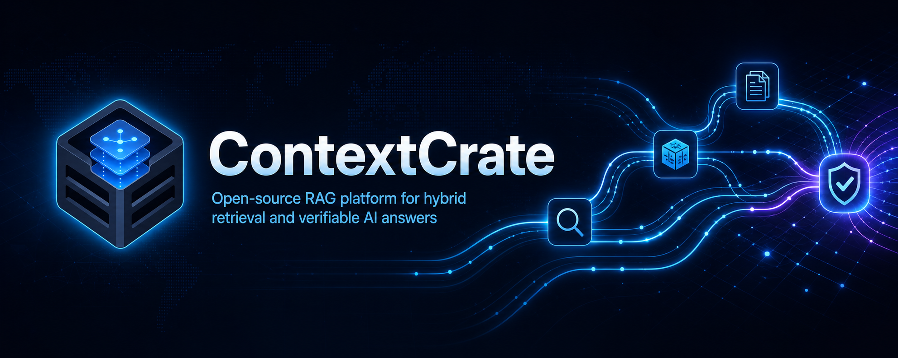
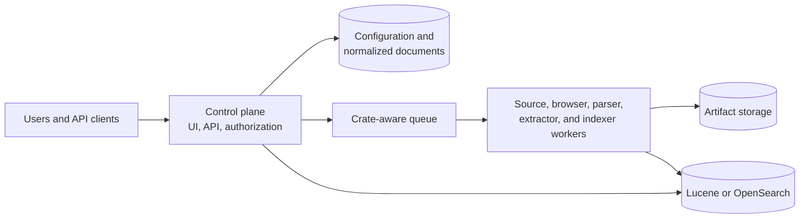
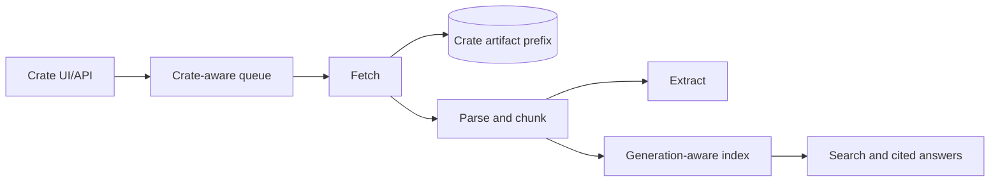

<div align="center">

  <h1>ContextCrate</h1>
  

  <p><strong>Turn your sources into trusted context.</strong></p>
  <p>Open-source, self-hosted RAG for hybrid retrieval and verifiable AI answers.</p>

</div>

ContextCrate is an open-source, self-hosted retrieval-augmented generation platform. It ingests websites and Git repositories, builds searchable context, and delivers grounded answers with citations you can inspect. Its top-level entity is a **crate**: an independently configured and authorized context workspace containing sources, ingestion jobs, documents, extraction rules, provider settings, artifacts, and its own vector-index namespace.

ContextCrate keeps that context on infrastructure you control, combines lexical and semantic retrieval, and makes answer evidence traceable back to the original source. 


## Capabilities

- **Crawl websites reliably** with HTTP or Playwright rendering, robots-policy enforcement, login support, retries, and crawler safety controls.
- **Ingest Git repositories** over public or token-authenticated HTTPS, selecting branches, tags, paths, and Markdown or text content.
- **Organize knowledge into crates** with isolated sources, indexes, settings, members, and service keys for each team or use case.
- **Search with hybrid retrieval** by combining BM25 keyword search and semantic vectors with reciprocal-rank fusion, filters, and optional cross-encoder reranking.
- **Generate grounded answers** through OpenAI-compatible models, with streaming responses, stable source lists, and inline citations that lead back to the indexed evidence.
- **Connect any OpenAI client** to a crate directly — Open WebUI, LiteLLM, the OpenAI SDKs — through a per-crate OpenAI-compatible `chat/completions` endpoint, no custom integration code required.
- **Improve answer quality** with retrieved-chunk grading, proposition retrieval, and configurable answer verification that can revise, block, or warn about unsupported claims.
- **Choose your AI providers** with local ONNX models or OpenAI-compatible embedding, reranking, and answer endpoints configured per crate.
- **Manage data safely** with document versions, background index rebuilds, archive/restore, checksummed crate export/import, and audit-aware access controls.
- **Automate through the UI or API** using personal API keys and crate-specific Viewer or Editor service keys.
- **Deploy from laptop to cluster** with standalone Docker or Compose for compact installs and Kubernetes with PostgreSQL, RabbitMQ, S3-compatible storage, and OpenSearch for production scale.

## Architecture

The **control plane** exposes the crate-qualified UI and API, applies membership authorization, and owns configuration plus normalized documents in the relational database. **Workers** acquire website and Git sources, optionally render pages in a browser, normalize content, extract metadata, and build the search index. A crate-aware queue coordinates that work; raw source bodies live in artifact storage, while Lucene or OpenSearch serves lexical, semantic, and hybrid retrieval.



**Standalone** runs the control plane, workers, queue, H2 database, filesystem artifacts, and Lucene in one JVM. It is designed for local use and compact single-instance deployments. 

**Distributed** runs the control plane and worker roles separately, with PostgreSQL, RabbitMQ, S3-compatible storage, and OpenSearch; each workload can then scale independently. 

Kubernetes is the intended production deployment. See the [architecture documentation](docs/architecture.md) and [Kubernetes installation guide](docs/installation/kubernetes.md) for the complete design.

## Pipeline example

An ingestion run begins when a crate submits a website or Git source to the queue. Fetch workers acquire the selected pages or repository files and retain the raw result in crate-scoped artifact storage. Parser workers then normalize that content into documents and deterministic chunks. Extraction creates optional derived metadata, while the indexer builds a new search generation from the normalized records. Once the generation is complete, ContextCrate can serve lexical, semantic, or hybrid search and use the selected evidence to stream cited answers.



Raw artifacts remain separate from normalized documents so parsing and indexing can be rebuilt without re-crawling the original source. Every content row, queue message, artifact key, and search operation carries crate identity. Lucene uses `data/index/crates/{crateId}/{generation}`; OpenSearch uses `{prefix}-crate-{crateId}-{generation}`. See the [pipeline documentation](docs/pipeline.md) for work lifecycle, connector behavior, retries, and indexing details.


## Quick start

ContextCrate is intended for Kubernetes in production. The Helm-based Kubernetes installation is documented in the [installation guides](docs/installation/kubernetes.md). Docker and Docker Compose are useful for local development, evaluation, and smaller standalone deployments.

### Docker

Run a standalone instance with a persistent named volume:

```bash
docker run --rm -p 8080:8080 -v contextcrate-data:/app/data -e CONTEXTCRATE_ADMIN_PASSWORD=change-me ghcr.io/wenisch-tech/contextcrate:latest
```

### Docker Compose

Run the standalone Compose setup from a source checkout:

```bash
CONTEXTCRATE_ADMIN_PASSWORD=change-me docker compose up --build
```

Open <http://localhost:8080> and sign in with `admin@contextcrate.local` and the password you set. The named volume preserves application data and downloaded local models between restarts.

For the distributed evaluation stack, use `CONTEXTCRATE_ADMIN_PASSWORD=change-me docker compose -f compose.distributed.yml up`. It includes PostgreSQL, RabbitMQ, MinIO, and OpenSearch for experimentation; use Kubernetes with independently operated backing services for production.

The first authenticated user owns the automatically migrated Legacy crate. New users see crate onboarding according to the global creation policy. For a production deployment, configure a persistent data volume and set `CONTEXTCRATE_ADMIN_PASSWORD` before exposing the service.

## Documentation

- [Installation overview](docs/installation/README.md)
- [Docker installation](docs/installation/docker.md)
- [Docker Compose installation](docs/installation/compose.md)
- [Kubernetes installation](docs/installation/kubernetes.md)
- [JAR installation](docs/installation/jar.md)
- [Crates and lifecycle](docs/crates.md)
- [Authorization](docs/authorization.md)
- [Architecture](docs/architecture.md)
- [Configuration](docs/configuration.md)
- [REST API](docs/api.md)
- [OpenAI-compatible API](docs/integrations/openai.md)
- [Operations](docs/operations.md)
- [Export and import](docs/backup-migration.md)
- [Upgrade from Harvex](docs/upgrade-from-harvex.md)
- [Tutorials](docs/tutorials.md)

ContextCrate is licensed under AGPL-3.0.

