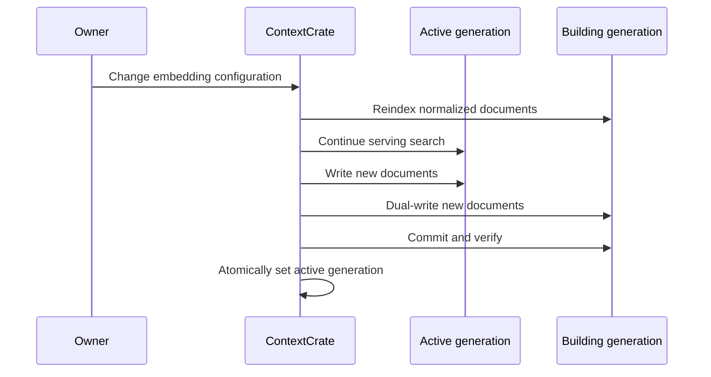

# Architecture

ContextCrate is a Spring Boot application that can run all stages in one process or distribute them across control-plane, HTTP crawler, browser crawler, parser, extractor, and indexer roles.

```mermaid
flowchart LR
  UI[Crate-qualified UI/API] --> AUTH[Membership authorization]
  AUTH --> DB[(Relational store)]
  DB --> Q[Crate-aware work queue]
  Q --> C[HTTP/browser crawl]
  C --> A[(crates/{crateId} artifacts)]
  C --> P[Parse and discover]
  P --> D[(Documents and chunks)]
  D --> E[Extraction]
  D --> I[Generation-aware indexer]
  I --> N[(Crate index namespace)]
  UI --> N
```

## Ownership propagation

`crate_id` is stored on every crate-owned row rather than inferred only through joins. Pipeline schema v2 duplicates it in the envelope and JSON payload. This deliberate redundancy lets repositories scope queries efficiently and lets workers detect inconsistent or malicious references before doing work.

Delivery is at least once. Idempotency keys include crate identity, and entity relationships are verified at each stage.

## Storage adapters

The relational database owns canonical configuration and normalized content. Raw bodies use `ArtifactStore` with filesystem or S3 implementations. Search uses `SearchIndex` with Lucene or OpenSearch implementations. Index data and embeddings are derived and rebuildable.

Backends are installation-wide services, while prefixes/directories and configuration are crate-specific.

## Provider resolution

Embedding and answer settings are keyed by crate. An execution context selects the correct provider configuration for crawl-index work, search queries, and asynchronous answer streaming. Local model assets may share an installation cache, but vector namespaces and credentials do not.

## Generation switch



If the build fails, its error is recorded and its namespace is removed; the previous active generation is unchanged.
