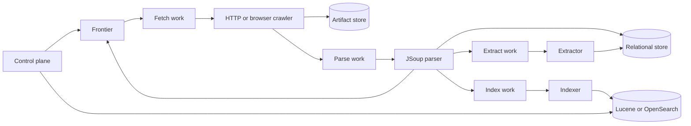

# Architecture

## Modules and roles

The code is separated into control-plane, crawl, queue, storage, parsing, index, security, backup, repository, and web packages. All backend decisions terminate at `PipelineQueue`, `ArtifactStore`, and `SearchIndex` interfaces.

`all` runs every module. Distributed roles are `control-plane`, `crawler-http`, `crawler-browser`, `parser`, `extractor`, and `indexer`.

## Consistency

Work delivery is at least once. IDs derive from run, canonical URL, document, and chunk identity. Local work is leased from the database; stale processing leases become claimable after restart. RabbitMQ uses durable queues and stage-specific DLQs. Artifacts are written before their database references and are protected by SHA-256 metadata.

## Storage model

PostgreSQL/H2 owns configurations, immutable runs, frontier state, fetch metadata, normalized documents, chunks, extraction rules, extraction results, users, and local work. Raw bodies live behind `ArtifactStore`. Search indices and extraction results are derived and may be rebuilt from normalized records. The search API reads the active `SearchIndex` backend, so Lucene and OpenSearch expose the same retrieval contract.
