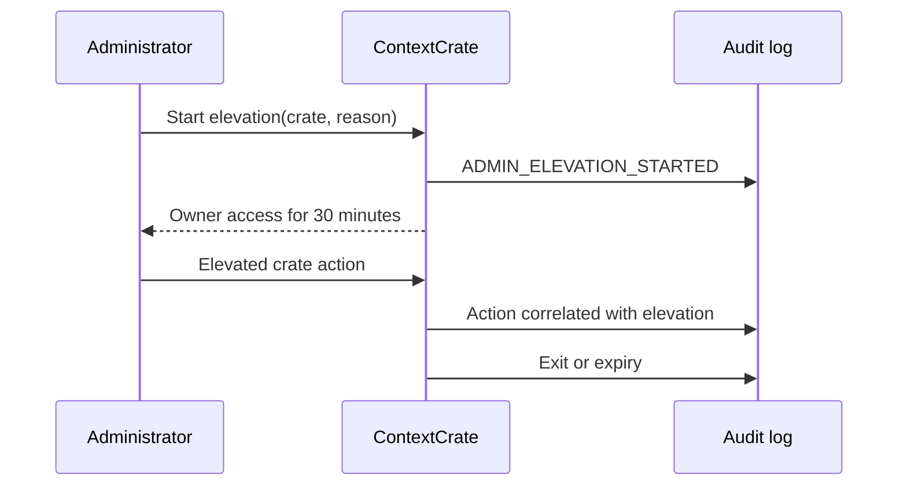

# Authorization

ContextCrate separates installation administration from crate membership. Being a global administrator does not silently grant access to crate content.

## Role matrix

| Capability | Viewer | Editor | Owner |
|---|:---:|:---:|:---:|
| Browse sources, ingestion jobs, runs, documents, and results | ✓ | ✓ | ✓ |
| Search and generate answers | ✓ | ✓ | ✓ |
| Create/edit sources/jobs and start/cancel runs |  | ✓ | ✓ |
| Manage extraction rules and rebuilds |  | ✓ | ✓ |
| Commit or rebuild an index |  | ✓ | ✓ |
| Change RAG/provider settings |  |  | ✓ |
| Manage members and crate keys |  |  | ✓ |
| Export, archive, restore, or purge |  |  | ✓ |

A crate must always retain at least one Owner.

## Administrator elevation

Administrators manage accounts, entitlements, global creation policy, queues, and infrastructure. To inspect or change crate content they must enter a reason and start a temporary elevation.

The UI displays a persistent elevation banner. Elevation ends explicitly or after 30 minutes. It never changes the crate membership table.

Elevations are started and ended from the administration panel at `/admin` — see [Administration](operations/administration.md), which also documents the rules that stop an administrator from locking themselves, or the installation, out.

## API keys

Personal keys belong to a user and follow that user's changing memberships. Crate service keys belong to one crate and receive fixed Viewer or Editor authority; service keys cannot be Owners.

Tokens begin with `cc_` and are shown only once. They are presented either as `X-API-KEY` or as `Authorization: Bearer <token>`; the bearer form exists so that MCP clients, which send it by convention, can authenticate. HTTP Basic credentials are never treated as a token. ContextCrate stores a SHA-256 hash and a short display prefix. Revoking a personal key requires its owner; revoking a crate key requires a crate Owner.

## Resource authorization

Authorization is based on the crate in the URL and the resource's stored `crate_id`. Session state is only a navigation preference. Supplying an ID from another crate results in denial or not-found behavior and never causes ContextCrate to infer a different crate.
