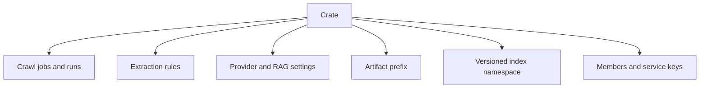
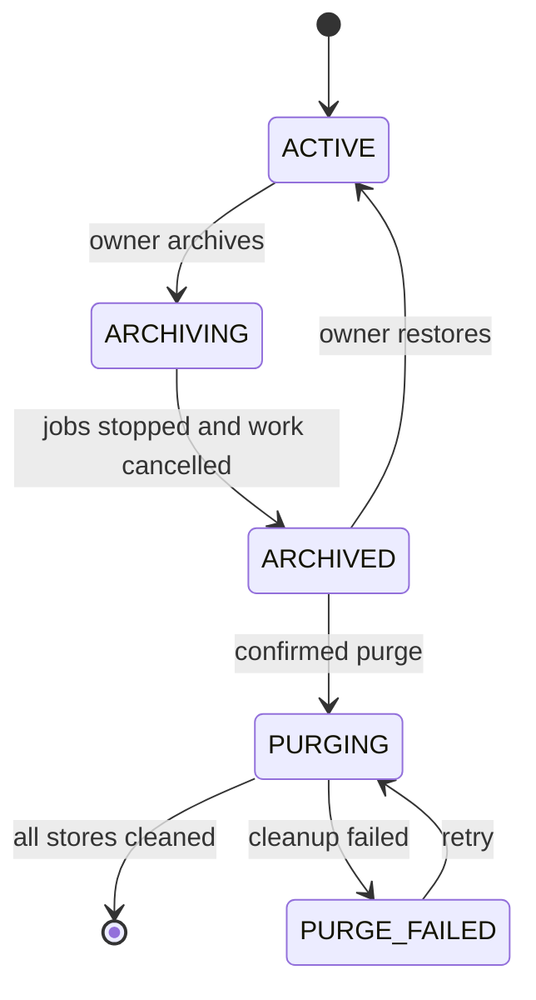

# Crates

A **crate** is ContextCrate's mandatory isolation and collaboration boundary. It contains crawl jobs, runs, artifacts, normalized documents, chunks, extraction rules and results, retrieval settings, provider credentials, and vector-index generations.

The term *namespace* is reserved for the physical Lucene directory or OpenSearch index owned by a crate. It is never used as a synonym for a crate in the UI or API.

## Isolation guarantees

Every persisted content record carries `crate_id`. Queue envelopes and payloads carry the same identifier, artifact keys begin with `crates/{crateId}/`, and search routes to the active index generation belonging to that crate. A run ID can narrow a search, but it cannot replace crate scope.

Repository and service methods must receive the crate explicitly. Controllers authorize the requested crate before loading a resource, and workers reject messages whose envelope, payload, and referenced entities disagree.

## Creation

The global administrator selects one creation policy:

| Mode | Behavior |
|---|---|
| `EVERYONE` | Every active user may create crates and becomes Owner. This is the default. |
| `ADMINS_ONLY` | Only installation administrators may create crates. |
| `ENTITLED_USERS` | Administrators grant creation permission per account. |

Users without a membership see crate onboarding when creation is allowed. Otherwise, ContextCrate explains that an administrator must assign a crate.

## Lifecycle

Archived crates remain readable, searchable, and exportable. Processing and configuration mutations are blocked. Purge requires the exact crate name and removes keys, elevations, queued work, artifacts, index generations, and relational content through an idempotent background operation.

## Index generations

Lucene namespaces use `data/index/crates/{crateId}/{generation}`. OpenSearch indices use `{prefix}-crate-{crateId}-{generation}`.

Changing the embedding configuration creates a background generation. The old generation remains active while documents are rebuilt. New document indexing is dual-written to every building generation. ContextCrate commits and activates the new generation only after the rebuild succeeds; failure leaves the previous generation searchable.

## Portable crates

Owners can export a crate with or without raw artifacts. Bundles contain a schema-versioned manifest and SHA-256 checksums. Provider keys, crawler passwords, users, memberships, API keys, elevations, and audit logs are excluded.

Import always creates a new crate and remaps internal UUIDs. Missing credentials must be entered by the new owner, and imported documents are queued for indexing into a new namespace.
